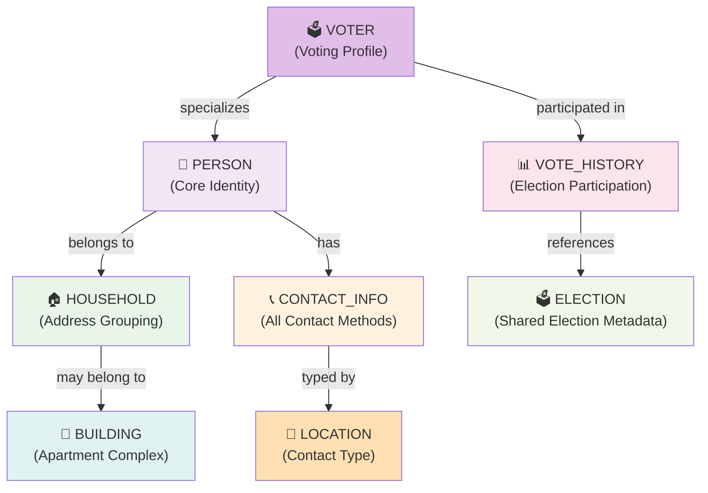

# Person-Centric Data Architecture (with Voter Type)

**Purpose**: Define how voter files decompose into normalized database models  
**Date**: February 16, 2026  
**Implementation**: Contra Costa County voter file + Simple CSV

---

## Overview: From File to Database

A voter file contains dense records. We normalize into core models with **PERSON** as the central entity and **VOTER** as a specialized type:

### High-Level Model Relationships



### Detailed Entity-Relationship Diagram

```mermaid
erDiagram
    VOTER_FILE ||--|| PERSON : splits_into
    VOTER_FILE ||--|| VOTER : creates
    VOTER_FILE ||--|| HOUSEHOLD : creates
    VOTER_FILE ||--o{ CONTACT_INFO : generates
    VOTER_FILE ||--o{ VOTE_HISTORY : contains
    VOTE_HISTORY ||--|| ELECTION : references

    VOTER ||--|| PERSON: "specializes"
    PERSON }o--|| HOUSEHOLD: "belongs_to"
    HOUSEHOLD }o--|| BUILDING: "may_be_in"
    PERSON ||--o{ CONTACT_INFO: "has"
    PERSON ||--o{ CONTACT_LOG: "receives"
    VOTER ||--o{ VOTE_HISTORY: "participated_in"

    CONTACT_INFO ||--|| LOCATION: "typed_by"
    VOTE_HISTORY ||--o| ELECTION: "references"

    VOTER_FILE {
        string registrationNumber
        string firstName
        string lastName
        string gender
        datetime birthDate
        string partyAbbr
        string houseNumber
        string streetName
        string city
        string zipCode
        string phone
        string email
        datetime electionDate_1
        string ballotPartyAbbr_1
    }

    PERSON {
        string id PK
        string firstName
        string lastName
        string middleName
        string nameSuffix
        string gender
        datetime birthDate
        string birthPlace
        string language
        string householdId FK
        string notes
    }

    VOTER {
        string id PK
        string personId UK FK
        string registrationNumber UK
        string voterFileId
        string title
        datetime registrationDate
        string partyName
        string partyAbbr
        string vbmStatus
        string precinctId
        string precinctPortion
        string precinctName
        string contactStatus
        datetime lastContactDate
        string lastContactMethod
        string importedFrom
        string importType
        string importFormat
    }

    BUILDING {
        string id PK
        string streetNumber
        string preDirection
        string streetName
        string streetSuffix
        string postDirection
        string city
        string state
        string zipCode
        string fullAddress UK
        string buildingType
        int totalUnits
        float latitude
        float longitude
    }

    HOUSEHOLD {
        string id PK
        string buildingId FK
        string houseNumber
        string preDirection
        string streetName
        string streetSuffix
        string postDirection
        string unitAbbr
        string unitNumber
        string city
        string state
        string zipCode
        string fullAddress UK
        int personCount
        int maxVotingScore
        float latitude
        float longitude
    }

    CONTACT_INFO {
        string id PK
        string personId FK
        string locationId FK
        string houseNumber
        string preDirection
        string streetName
        string streetSuffix
        string postDirection
        string unitAbbr
        string unitNumber
        string city
        string state
        string zipCode
        string fullAddress
        string phone
        string email
        boolean isPrimary
        boolean isVerified
        string source
    }

    VOTE_HISTORY {
        string id PK
        string voterId FK
        string electionId FK
        datetime electionDate
        string ballotPartyName
        string ballotPartyAbbr
        boolean ballotCounted
        string votingMethod
        string districtId
        string subDistrict
        string districtName
    }

    ELECTION {
        string id PK
        datetime electionDate UK
        string electionAbbr UK
        string electionDesc
        string electionType
        string jurisdictionCode
    }

    LOCATION {
        string id PK
        string name
    }

    CONTACT_LOG {
        string id PK
        string personId FK
        string contactType
        string outcome
        string notes
        boolean followUpNeeded
        datetime followUpDate
    }
```

---

## Model Definitions

### 1. **PERSON** (Core Identity)
Universal person record. Every human in the system is a PERSON. May also be a VOTER, volunteer, staff member, etc.

```typescript
model Person {
  id              String    @id @default(cuid())
  
  // Name components
  title           String?   // Mr, Ms, Dr, etc.
  firstName       String
  middleName      String?
  lastName        String
  nameSuffix      String?   // Jr, Sr, III, etc.
  
  // Demographics
  gender          String?   // M, F, U, X
  birthDate       DateTime?
  birthPlace      String?   // State/Country code
  language        String?   // Preferred language
  
  // Household grouping
  householdId     String?
  household       Household? @relation(fields: [householdId], references: [id])
  
  // Notes
  notes           String?
  
  // Relations
  voter           Voter?    // Optional: if this person is registered to vote
  contactInfo     ContactInfo[]
  contactLogs     ContactLog[]
  
  // Timestamps
  createdAt       DateTime  @default(now())
  updatedAt       DateTime  @updatedAt
  
  @@index([firstName, lastName])
  @@index([householdId])
}
```

**When Created**: Parsed from voter file record

**Why Separate**:
- Core identity independent of voter registration status
- Future: Support volunteers, staff, non-registered contacts
- Single source of truth for a human being
- Enables other record types (volunteer, staff, contact) to reference same PERSON

---

### 2. **VOTER** (Voting Profile)
Specializes PERSON with voter registration data. One-to-one relationship with PERSON.

```typescript
model Voter {
  id              String    @id @default(cuid())
  
  // Link to core identity
  personId        String    @unique
  person          Person    @relation(fields: [personId], references: [id], onDelete: Cascade)
  
  // Registration identity (from voter file)
  registrationNumber String? @unique  // County's internal voter ID
  voterFileId        String?          // External voter ID from jurisdiction
  
  // Registration info
  title           String?   // Mr, Ms, Dr, etc. (redundant with Person, but from file)
  registrationDate DateTime?
  partyName       String?   // Democratic, Republican, American Independent, etc.
  partyAbbr       String?   // D, R, AI, G, L, N, U
  vbmStatus       String?   // Permanent VBM, Conditional Voter Registration, etc.
  
  // Precinct (voting location grouping)
  precinctId      String?
  precinctPortion String?
  precinctName    String?
  
  // Canvassing status (app-driven, mutable)
  contactStatus   String    @default("pending") 
                  // pending, attempted, contacted, refused, unreachable, moved
  lastContactDate DateTime?
  lastContactMethod String?   // call, email, door, sms
  
  // Import tracking
  importedFrom    String?   // "contra_costa", "simple_csv", filename
  importType      String?   // "full" or "incremental"
  importFormat    String?   // voter file format identifier
  importFile      String?   // SHA hash of source file (anti-duplication)
  
  // Relations
  voteHistory     VoteHistory[]
  
  // Timestamps
  createdAt       DateTime  @default(now())
  updatedAt       DateTime  @updatedAt
  
  @@index([registrationNumber])
  @@index([voterFileId])
  @@index([precinctId])
  @@index([partyAbbr])
  @@index([contactStatus])
}
```

**When Created**: On voter file import

**Why Separate from PERSON**:
- Voter registration is specific, mutable, file-driven
- Demographics (birthDate, gender, name) are immutable (Person)
- Voter status (party, precinct, contactStatus) are mutable (Voter)
- Future: Support non-voters (volunteers, staff) as PERSON without VOTER

---

### 3. **ELECTION** (Shared Lookup)
Immutable record of elections. Created once, referenced by VoteHistory.

```typescript
model Election {
  id              String   @id @default(cuid())
  
  // Election identity
  electionDate    DateTime @unique  // 2022-11-08, 2024-11-05, etc.
  electionAbbr    String?  @unique  // "GEN24", "PRI22", "SP23"
  electionDesc    String?           // "2024 General Election"
  electionType    String?           // General, Primary, Special, Local
  
  // Metadata
  jurisdictionCode String?
  
  // Relations
  voteHistory     VoteHistory[]
  
  createdAt       DateTime @default(now())
  
  @@index([electionDate])
}
```

**When Created**: On first voter import that references an election date

**Why Separate**: 
- Share across all voters (150K voters, maybe 20 elections)
- Canonical election info (date, type, description)
- Enables election-based queries: "How many voted in 2024?"

---

### 4. **HOUSEHOLD** (Address Grouping)
Groups people at the same residence address together.

```typescript
model Household {
  id              String   @id @default(cuid())
  
  // If this address is within an apartment building
  buildingId      String?
  building        Building? @relation(fields: [buildingId], references: [id])
  
  // Address (normalized from residence)
  houseNumber     String?
  preDirection    String?
  streetName      String
  streetSuffix    String?
  postDirection   String?
  unitAbbr        String?   // Apt, Unit, Ste, etc.
  unitNumber      String?
  city            String
  state           String   @default("CA")
  zipCode         String
  fullAddress     String   @unique  // "123 Main St, San Francisco, CA 94102"
  
  // Derived stats
  personCount     Int      @default(1)
  maxVotingScore  Int?     // Highest voting frequency in house
  
  // Geolocation
  latitude        Float?
  longitude       Float?
  geocoded        Boolean  @default(false)
  geocodedAt      DateTime?
  
  // Relations
  people          Person[]
  
  createdAt       DateTime @default(now())
  updatedAt       DateTime @updatedAt
  
  @@unique([houseNumber, streetName, zipCode])
  @@index([buildingId])
  @@index([fullAddress])
  @@index([zipCode])
}
```

**When Created**: During voter import, grouped by residence address

**Why Separate**:
- Address is the grouping key
- One-to-many people per address (family households)
- Supports precinct work (knock on door once, contact all residents)
- Enables targeted canvassing (whole household contact strategy)

---

### 5. **BUILDING** (Multi-Unit Buildings)
Represents a single building address that contains multiple units/households.

```typescript
model Building {
  id              String   @id @default(cuid())
  
  // Building address
  streetNumber    String
  preDirection    String?
  streetName      String
  streetSuffix    String?
  postDirection   String?
  city            String
  state           String   @default("CA")
  zipCode         String
  fullAddress     String   @unique
  
  // Building metadata
  buildingType    String?   // "apartment", "condo", "townhouse", "mixed_use", etc.
  totalUnits      Int?      // Number of units in building
  
  // Geolocation
  latitude        Float?
  longitude       Float?
  geocoded        Boolean   @default(false)
  
  // Relations
  households      Household[]
  
  createdAt       DateTime  @default(now())
  updatedAt       DateTime  @updatedAt
  
  @@index([fullAddress])
  @@index([zipCode])
}
```

**When Created**: During voter import, when a household has a unit number (apartment)

**Why Separate**:
- Multi-unit buildings (apartment complexes) share the same street address
- One building can have many households (one per unit)
- Enables building-level canvassing (contact all residents in building)
- Useful for voter outreach at common areas (lobbies, mailrooms)

---

### 6. **CONTACT_INFO** (Multi-Method Contact)
All ways to reach a person (address, phone, email).

```typescript
model ContactInfo {
  id          String    @id @default(cuid())
  
  // Which person
  personId    String
  person      Person    @relation(fields: [personId], references: [id], onDelete: Cascade)
  
  // Location type
  locationId  String    // Foreign reference to Location seed data
  location    Location  @relation(fields: [locationId], references: [id])
  // Values: "residence", "mailing", "cell", "email_primary", "email_secondary", "work"
  
  // Address components (for physical addresses)
  houseNumber     String?
  preDirection    String?   // N, S, E, W
  streetName      String?
  streetSuffix    String?   // St, Ave, Ln, etc.
  postDirection   String?
  unitAbbr        String?   // Apt, Unit, Ste, etc.
  unitNumber      String?
  city            String?
  state           String?   @default("CA")
  zipCode         String?
  fullAddress     String?   // Computed or imported
  
  // Digital contact
  phone           String?   // E.164 format: +1-650-253-0000
  email           String?   // Normalized lowercase
  
  // Verification / Priority
  isVerified      Boolean   @default(false)   // Verified as working
  isPrimary       Boolean   @default(false)   // Primary method for this type
  isCurrently     Boolean   @default(true)    // Still valid (not "moved")
  
  // Tracking
  source          String?   // "county_file", "enrichment", "user_entry"
  verifiedAt      DateTime?
  violationCount  Int       @default(0)       // Violations if shared (TCPA)
  
  createdAt       DateTime  @default(now())
  updatedAt       DateTime  @updatedAt
  
  @@index([personId])
  @@index([locationId])
  @@index([phone])
  @@index([email])
  @@index([isPrimary])
  @@unique([personId, locationId, fullAddress])  // One record per person per address type
}
```

**When Created**: Parsed from voter file (residence, mailing, phone, email)

**Why Separate**:
- Multiple contact methods per person (home, cell, mailing address, email)
- Location-typed (residence for knocking on doors, cell for calls)
- Verification status (county file is verified, enriched data is not)
- TCPA compliance (track which numbers have violations)

---

### 7. **VOTE_HISTORY** (Election Participation)
Record of each election a voter participated in.

```typescript
model VoteHistory {
  id          String    @id @default(cuid())
  
  // Which voter cast ballot
  voterId     String
  voter       Voter     @relation(fields: [voterId], references: [id], onDelete: Cascade)
  
  // Which election
  electionId  String?
  election    Election? @relation(fields: [electionId], references: [id])
  
  // Fallback if election not yet created (from raw file)
  electionAbbr    String?
  electionDesc    String?
  electionDate    DateTime?
  electionType    String?   // General, Primary, Special, etc.
  
  // Ballot info
  ballotPartyName String?   // Party on ballot (may differ from registration)
  ballotPartyAbbr String?
  ballotCounted   Boolean   @default(false)
  
  // Voting method
  votingMethod    String?   // "Absentee", "Polling Place", "Early Voting", "Provisional"
  
  // District context (at time of election)
  districtId      String?
  subDistrict     String?
  districtName    String?
  
  // Timestamps
  createdAt       DateTime  @default(now())
  
  @@unique([voterId, electionDate])
  @@index([voterId])
  @@index([electionDate])
  @@index([ballotCounted])
  @@index([votingMethod])
}
```

**When Created**: Parsed from voter file (5 most recent elections per Contra Costa record)

**Why Separate**:
- Voter can have 1-N elections (up to 30+ year history in county files)
- Immutable history (from county file, never changes)
- Enables targeting: "Voted 4 of 5 elections" = reliable voter
- Key canvassing metric: Predictive of turnout

---

### 8. **CONTACT_LOG** (Interaction History)
Record of all outreach/contact attempts with a person.

```typescript
model ContactLog {
  id          String    @id @default(cuid())
  
  personId    String
  person      Person    @relation(fields: [personId], references: [id], onDelete: Cascade)
  
  // Contact details
  contactType String    // call, email, door, sms
  outcome     String?   // contacted, refused, not_home, no_answer, moved, invalid
  notes       String?
  
  // Optional follow-up
  followUpNeeded Boolean @default(false)
  followUpDate   DateTime?
  
  createdAt   DateTime  @default(now())
  updatedAt   DateTime  @updatedAt
  
  @@index([personId])
  @@index([contactType])
  @@index([createdAt])
}
```

---

## Data Flow: File → Database

### Voter File Record (Abbreviated Example)

```
RegistrationNumber:  12345678
VoterID:            VOTER-001
FirstName:          Jane
LastName:           Smith
Gender:             F
BirthDate:          05/15/1980
RegistrationDate:   10/22/2016
PartyAbbr:          D
Language:           EN

// Residence
HouseNumber:        123
StreetName:         Main
StreetSuffix:       St
ResidenceCity:      San Francisco
ResidenceZipCode:   94102

// Contact
PhoneNumber:        650-555-0123
EmailAddress:       jane.smith@example.com

// Elections (5 most recent)
ElectionDate_1:     11/05/2024 → BallotCounted_1: Yes
ElectionDate_2:     08/06/2024 → BallotCounted_2: No
```

### Import Process (Step by Step)

#### **Step 1: Parse Core Identity → PERSON Record**

```typescript
INSERT INTO Person {
  firstName: "Jane",
  lastName: "Smith",
  gender: "F",
  birthDate: 1980-05-15,
  language: "EN"
}
→ person.id = "person-xyz123"
```

#### **Step 2: Parse Residence → HOUSEHOLD + Link**

```typescript
// Find or create household by address
UPSERT INTO Household {
  houseNumber: "123",
  streetName: "Main",
  streetSuffix: "St",
  city: "San Francisco",
  zipCode: "94102",
  fullAddress: "123 Main St, San Francisco, CA 94102"
}
→ household.id = "hh-abc456"

// Link person to household
UPDATE Person SET householdId = "hh-abc456" WHERE id = "person-xyz123"
```

#### **Step 3: Create VOTER Registration Profile**

```typescript
INSERT INTO Voter {
  personId: "person-xyz123",
  registrationNumber: "12345678",
  voterFileId: "VOTER-001",
  registrationDate: 2016-10-22,
  partyAbbr: "D",
  language: "EN",
  importedFrom: "contra_costa",
  contactStatus: "pending"
}
→ voter.id = "voter-def789"
```

#### **Step 4: Parse Contact Methods → CONTACT_INFO Records**

```typescript
// Residence address (primary)
INSERT INTO ContactInfo {
  personId: "person-xyz123",
  locationId: "loc-residence",
  fullAddress: "123 Main St, San Francisco, CA 94102",
  isPrimary: true,
  source: "county_file"
}

// Phone (cell)
INSERT INTO ContactInfo {
  personId: "person-xyz123",
  locationId: "loc-cell",
  phone: "+16505550123",
  source: "county_file"
}

// Email
INSERT INTO ContactInfo {
  personId: "person-xyz123",
  locationId: "loc-email",
  email: "jane.smith@example.com",
  source: "county_file"
}
```

#### **Step 5: Parse Elections → VOTE_HISTORY**

```typescript
// Create Election (if not exists)
UPSERT INTO Election {
  electionDate: 2024-11-05,
  electionAbbr: "GEN24",
  electionType: "General"
}
→ election.id = "el-gen24"

// Link voter's participation
INSERT INTO VoteHistory {
  voterId: "voter-def789",
  electionId: "el-gen24",
  ballotCounted: true,
  votingMethod: "Absentee"
}
```

---

## Query Examples

### "All people in this household"
```sql
SELECT p.* FROM Person p
JOIN Household h ON p.householdId = h.id
WHERE h.fullAddress = '123 Main St, San Francisco, CA 94102'
```
**Use**: Knock-and-drop strategy; reach all household members

### "Voters with registration in this precinct"
```sql
SELECT v.*, p.firstName, p.lastName FROM Voter v
JOIN Person p ON v.personId = p.id
WHERE v.precinctId = 'PRECINCT-123'
```
**Use**: Precinct targeting, demographic analysis

### "How reliable is this voter?"
```sql
SELECT v.registrationNumber,
       COUNT(*) as elections_voted,
       ROUND(COUNT(*) * 100.0 / 5, 0) as voting_frequency
FROM VoteHistory vh
JOIN Voter v ON vh.voterId = v.id
WHERE v.id = 'voter-def789'
  AND vh.ballotCounted = true
```
**Use**: Score voters by participation (4/5 = reliable)

### "All contact methods for a person"
```sql
SELECT locationId, phone, email, fullAddress, isPrimary, isVerified
FROM ContactInfo
WHERE personId = 'person-xyz123'
ORDER BY isPrimary DESC, isVerified DESC
```
**Use**: Determine best way to reach person

### "Voters not yet contacted"
```sql
SELECT v.*, p.firstName, p.lastName FROM Voter v
JOIN Person p ON v.personId = p.id
WHERE v.contactStatus = 'pending'
LIMIT 100
```
**Use**: Canvassing assignment

---

## Import Checklist

- [ ] Location seed data loaded (residence, mailing, cell, email types)
- [ ] Voter file validated (field count, delimiters, encoding)
- [ ] Upsert logic: registrationNumber unique for VOTER, or create new?
- [ ] Household grouping: normalize addresses first (remove punctuation, trim)
- [ ] De-duplication: Check for duplicate phone/email within household
- [ ] Election lookup: Fetch or create elections on-the-fly?
- [ ] Contact info verification: County file = verified, enriched data ≠ verified
- [ ] Building detection: Identify apartments (unit abbr/number present)
- [ ] Progress tracking: Log every 100 records
- [ ] Error handling: Skip bad records, log errors, don't fail hard

---

## Summary

| Model | Purpose | Source | Mutability |
|-------|---------|--------|-----------|
| **Person** | Core human identity | File parsing | Immutable (static demographics) |
| **Voter** | Voting registration profile | File (core), App (canvassing status) | Mostly immutable (registration) + Mutable (contact status) |
| **Election** | Shared election metadata | File parsing | Immutable (created once) |
| **Building** | Multi-unit apartment complex | Voter address (if has unit) | Mostly immutable (totalUnits may change) |
| **Household** | Address grouping (may be in building) | Person residence | Mostly immutable (personCount changes) |
| **ContactInfo** | All contact methods | File + Enrichment | Mutable (verification) |
| **VoteHistory** | Election participation | File (county history) | Immutable (from file) |
| **ContactLog** | Interaction history | App (canvassing) | Immutable (audit trail) |

This architecture enables:
- ✅ Core identity separate from voter registration
- ✅ Future support for volunteers, staff, non-registered contacts
- ✅ Fast person/voter lookups (by name, address, phone, email)
- ✅ Apartment-aware grouping (building → households → people)
- ✅ Household-based canvassing (whole address contact)
- ✅ Building-level outreach (common area strategies)
- ✅ Predictive targeting (voting frequency scores)
- ✅ Multi-format imports (Contra Costa, Simple CSV, etc.)
- ✅ Clear separation: registration data (immutable) vs app state (mutable)
