# Voter File-Centric Architecture

**Purpose**: Define how voter files decompose into normalized database models  
**Date**: February 16, 2026  
**Implementation**: Contra Costa County voter file + Simple CSV

---

## Overview: From File to Database

A voter file contains dense records. We normalize into 5 interconnected models:

### High-Level Model Relationships

```mermaid
graph TD
    VF["📄 VOTER FILE<br/>(Input)"]
    V["👤 VOTER<br/>(Person Identity)"]
    H["🏠 HOUSEHOLD<br/>(Address Grouping)"]
    C["📞 CONTACT_INFO<br/>(All Contact Methods)"]
    E["🗳️ ELECTION<br/>(Shared Election Metadata)"]
    VH["📊 VOTE_HISTORY<br/>(Election Participation)"]
    
    VF -->|creates| V
    VF -->|groups by| H
    VF -->|extracts| C
    VF -->|parses| VH
    
    V -->|belongs to| H
    V -->|has| C
    V -->|participated in| VH
    
    VH -->|references| E
    E -->|1 election, many voters| VH
    
    style VF fill:#e1f5ff
    style V fill:#f3e5f5
    style H fill:#e8f5e9
    style C fill:#fff3e0
    style VH fill:#fce4ec
    style E fill:#f1f8e9
```



### Detailed Entity-Relationship Diagram


---

## Model Definitions

### 1. **ELECTION** (Shared Lookup)
Immutable record of elections. Created once, referenced by VoteHistory.

```typescript
model Election {
  id              String   @id @default(cuid())
  
  // Election identity
  electionDate    DateTime @unique  // 2022-11-08, 2024-11-05, etc.
  electionAbbr    String?  @unique  // "GEN24", "PRI22", "SP23"
  electionDesc    String?           // "2024 General Election"
  electionType    String?           // General, Primary, Special, Local
  
  // Metadata
  jurisdictionCode String?
  
  // Relations
  voteHistory     VoteHistory[]
  
  createdAt       DateTime @default(now())
  
  @@index([electionDate])
}
```

**When Created**: On first voter import that references an election date

**Why Separate**: 
- Share across all voters (150K voters, maybe 20 elections)
- Canonical election info (date, type, description)
- Enables election-based queries: "How many voted in 2024?"

---

### 2. **HOUSEHOLD** (Address Grouping)
Groups voters at the same residence address together.

```typescript
model Household {
  id              String   @id @default(cuid())
  
  // Address (normalized from residence)
  houseNumber     String?
  preDirection    String?
  streetName      String
  streetSuffix    String?
  postDirection   String?
  city            String
  state           String   @default("CA")
  zipCode         String
  fullAddress     String   @unique  // "123 Main St, San Francisco, CA 94102"
  
  // Derived stats
  voterCount      Int      @default(1)
  maxVotingScore  Int?     // Highest voting frequency in house
  
  // Geolocation
  latitude        Float?
  longitude       Float?
  geocoded        Boolean  @default(false)
  geocodedAt      DateTime?
  
  // Relations
  voters          Voter[]
  
  createdAt       DateTime @default(now())
  updatedAt       DateTime @updatedAt
  
  @@unique([houseNumber, streetName, zipCode])
  @@index([fullAddress])
  @@index([zipCode])
}
```

**When Created**: During voter import, grouped by residence address

**Why Separate**:
- Address is the grouping key
- One-to-many voters per address (family households)
- Supports precinct work (knock on door once, contact all residents)
- Enables targeted canvassing (whole household contact strategy)

---

### 3. **VOTER** (Core Person Record)
Individual voter identity and registration status.

```typescript
model Voter {
  id                String    @id @default(cuid())
  
  // Primary key in county file
  registrationNumber String? @unique  // County's internal voter ID
  voterFileId        String?          // External voter ID from jurisdiction
  
  // Name components
  title             String?   // Mr, Ms, Dr, etc.
  firstName         String
  middleName        String?
  lastName          String
  nameSuffix        String?   // Jr, Sr, III, etc.
  
  // Demographics (from voter file)
  gender            String?   // M, F, U, X
  birthDate         DateTime?
  birthPlace        String?   // State/Country code
  language          String?   // Preferred language
  
  // Voter registration status
  registrationDate  DateTime?
  partyName         String?   // Democratic, Republican, American Independent, etc.
  partyAbbr         String?   // D, R, AI, G, L, N, U
  vbmStatus         String?   // Permanent VBM, Conditional Voter Registration, etc.
  
  // Precinct (voting location grouping)
  precinctId        String?
  precinctPortion   String?
  precinctName      String?
  
  // Household relationship
  householdId       String?
  household         Household? @relation(fields: [householdId], references: [id])
  
  // Canvassing status (app-driven)
  contactStatus     String    @default("pending") 
                    // pending, attempted, contacted, refused, unreachable, moved
  lastContactDate   DateTime?
  lastContactMethod String?   // call, email, door, sms
  
  // Import tracking
  importedFrom      String?   // "contra_costa", "simple_csv", filename
  importType        String?   // "full" or "incremental"
  importFormat      String?   // voter file format identifier
  importFile        String?   // SHA hash of source file (anti-duplication)
  importedAt        DateTime?
  
  // Notes
  notes             String?
  
  // Relations
  contactInfo       ContactInfo[]
  contactLogs       ContactLog[]
  voteHistory       VoteHistory[]
  
  // Timestamps
  createdAt         DateTime  @default(now())
  updatedAt         DateTime  @updatedAt
  
  @@index([registrationNumber])
  @@index([voterFileId])
  @@index([lastName, firstName])
  @@index([householdId])
  @@index([precinctId])
  @@index([partyAbbr])
  @@index([contactStatus])
  @@index([registeredAt])
}
```

**When Created**: On voter file import

**Why Separate**:
- Voter is the entity, everything else references it
- Single point of truth for person identity
- Immutable registration data (from county file)
- Mutable canvassing status (contactStatus, lastContactDate)

---

### 4. **CONTACT_INFO** (Multi-Method Contact)
All ways to reach a voter (address, phone, email).

```typescript
model ContactInfo {
  id          String    @id @default(cuid())
  
  // Which voter
  voterId     String
  voter       Voter     @relation(fields: [voterId], references: [id], onDelete: Cascade)
  
  // Location type
  locationId  String    // Foreign reference to Location seed data
  location    Location  @relation(fields: [locationId], references: [id])
  // Values: "residence", "mailing", "cell", "email_primary", "email_secondary", "work"
  
  // Address components (for physical addresses)
  houseNumber     String?
  preDirection    String?   // N, S, E, W
  streetName      String?
  streetSuffix    String?   // St, Ave, Ln, etc.
  postDirection   String?
  unitAbbr        String?   // Apt, Unit, Ste, etc.
  unitNumber      String?
  city            String?
  state           String?   @default("CA")
  zipCode         String?
  fullAddress     String?   // Computed or imported
  
  // Digital contact
  phone           String?   // E.164 format: +1-650-253-0000
  email           String?   // Normalized lowercase
  
  // Verification / Priority
  isVerified      Boolean   @default(false)   // Verified as working
  isPrimary       Boolean   @default(false)   // Primary method for this type
  isCurrently     Boolean   @default(true)    // Still valid (not "moved")
  
  // Tracking
  source          String?   // "county_file", "enrichment", "user_entry"
  verifiedAt      DateTime?
  violationCount  Int       @default(0)       // Violations if shared (TCPA)
  
  createdAt       DateTime  @default(now())
  updatedAt       DateTime  @updatedAt
  
  @@index([voterId])
  @@index([locationId])
  @@index([phone])
  @@index([email])
  @@index([isPrimary])
  @@unique([voterId, locationId, fullAddress])  // One record per voter per address type
}
```

**When Created**: Parsed from voter file (residence, mailing, phone, email)

**Why Separate**:
- Multiple contact methods per voter (home, cell, mailing address, email)
- Location-typed (residence for knocking on doors, cell for calls)
- Verification status (county file is verified, enriched data is not)
- TCPA compliance (track which numbers have violations)

---

### 5. **VOTE_HISTORY** (Election Participation)
Record of each election a voter participated in.

```typescript
model VoteHistory {
  id          String    @id @default(cuid())
  
  // Which voter cast ballot
  voterId     String
  voter       Voter     @relation(fields: [voterId], references: [id], onDelete: Cascade)
  
  // Which election
  electionId  String?
  election    Election? @relation(fields: [electionId], references: [id])
  
  // Fallback if election not yet created (from raw file)
  electionAbbr    String?
  electionDesc    String?
  electionDate    DateTime?
  electionType    String?   // General, Primary, Special, etc.
  
  // Ballot info
  ballotPartyName String?   // Party on ballot (may differ from registration)
  ballotPartyAbbr String?
  ballotCounted   Boolean   @default(false)
  
  // Voting method
  votingMethod    String?   // "Absentee", "Polling Place", "Early Voting", "Provisional"
  
  // District context (at time of election)
  districtId      String?
  subDistrict     String?
  districtName    String?
  
  // Timestamps
  createdAt       DateTime  @default(now())
  
  @@unique([voterId, electionDate])
  @@index([voterId])
  @@index([electionDate])
  @@index([ballotCounted])
  @@index([votingMethod])
}
```

**When Created**: Parsed from voter file (5 most recent elections per Contra Costa record)

**Why Separate**:
- Voter can have 1-N elections (up to 30+ year history in county files)
- Immutable history (from county file, never changes)
- Enables targeting: "Voted 4 of 5 elections" = reliable voter
- Key canvassing metric: Predictive of turnout

---

## Data Flow: File → Database

### Voter File Record (Abbreviated Example)

```
RegistrationNumber:  12345678
VoterID:            VOTER-001
FirstName:          Jane
LastName:           Smith
Gender:             F
BirthDate:          05/15/1980
RegistrationDate:   10/22/2016
PartyAbbr:          D
Language:           EN

// Residence
HouseNumber:        123
StreetName:         Main
StreetSuffix:       St
ResidenceCity:      San Francisco
ResidenceZipCode:   94102

// Mailing (if different)
MailAddress1:       PO Box 456
MailCity:           San Francisco
MailZip:            94102

// Contact
PhoneNumber:        650-555-0123
EmailAddress:       jane.smith@example.com

// Election History (5 most recent)
ElectionDate_1:     11/05/2024    → ElectionAbbr_1: GEN24, BallotCounted_1: Yes
ElectionDate_2:     08/06/2024    → ElectionAbbr_2: PRI24, BallotCounted_2: No
ElectionDate_3:     11/07/2022    → ElectionAbbr_3: GEN22, BallotCounted_3: Yes
ElectionDate_4:     06/07/2022    → ElectionAbbr_4: PRI22, BallotCounted_4: No
ElectionDate_5:     11/02/2020    → ElectionAbbr_5: GEN20, BallotCounted_5: Yes
```

### Import Process (Step by Step)

#### **Step 1: Parse Voter Identity → VOTER Record**

```
INSERT INTO Voter {
  registrationNumber: "12345678",
  voterFileId: "VOTER-001",
  firstName: "Jane",
  lastName: "Smith",
  gender: "F",
  birthDate: 1980-05-15,
  registrationDate: 2016-10-22,
  partyAbbr: "D",
  language: "EN",
  importedFrom: "contra_costa",
  importType: "full",
  contactStatus: "pending"
}
→ voter.id = "voter-xyz123"
```

#### **Step 2: Parse Residence → HOUSEHOLD + Link**

```
// First, find or create household by address
UPSERT INTO Household {
  houseNumber: "123",
  streetName: "Main",
  streetSuffix: "St",
  city: "San Francisco",
  zipCode: "94102",
  fullAddress: "123 Main St, San Francisco, CA 94102"
}
→ household.id = "hh-abc456"

// Link voter to household
UPDATE Voter SET householdId = "hh-abc456" WHERE id = "voter-xyz123"

// Update household stats
UPDATE Household SET voterCount = 2 WHERE id = "hh-abc456"
```

#### **Step 3: Parse Addresses → CONTACT_INFO Records**

```
// Residence address (primary)
INSERT INTO ContactInfo {
  voterId: "voter-xyz123",
  locationId: "loc-residence",
  houseNumber: "123",
  streetName: "Main",
  streetSuffix: "St",
  city: "San Francisco",
  zipCode: "94102",
  fullAddress: "123 Main St, San Francisco, CA 94102",
  isPrimary: true,
  source: "county_file"
}

// Mailing address (different)
INSERT INTO ContactInfo {
  voterId: "voter-xyz123",
  locationId: "loc-mailing",
  fullAddress: "PO Box 456, San Francisco, CA 94102",
  isPrimary: true,
  source: "county_file"
}

// Phone (cell)
INSERT INTO ContactInfo {
  voterId: "voter-xyz123",
  locationId: "loc-cell",
  phone: "+16505550123",
  isPrimary: true,
  source: "county_file"
}

// Email
INSERT INTO ContactInfo {
  voterId: "voter-xyz123",
  locationId: "loc-email",
  email: "jane.smith@example.com",
  isPrimary: true,
  source: "county_file"
}
```

#### **Step 4: Parse Elections → ELECTION (Shared) + VOTE_HISTORY**

```
// First, ensure Election records exist
UPSERT INTO Election {
  electionDate: 2024-11-05,
  electionAbbr: "GEN24",
  electionDesc: "2024 General Election",
  electionType: "General"
}
→ election.id = "el-gen24"

UPSERT INTO Election {
  electionDate: 2024-08-06,
  electionAbbr: "PRI24",
  electionType: "Primary"
}
→ election.id = "el-pri24"

// Then link voter's participation (5 records per voter)
INSERT INTO VoteHistory {
  voterId: "voter-xyz123",
  electionId: "el-gen24",
  electionDate: 2024-11-05,
  ballotCounted: true,
  votingMethod: "Absentee"
}

INSERT INTO VoteHistory {
  voterId: "voter-xyz123",
  electionId: "el-pri24",
  electionDate: 2024-08-06,
  ballotCounted: false
}

... (3 more for elections 3-5)
```

---

## Query Examples

### "Who lives in this household?"
```sql
SELECT v.* FROM Voter v
JOIN Household h ON v.householdId = h.id
WHERE h.fullAddress = '123 Main St, San Francisco, CA 94102'
```
**Use**: Knock-and-drop strategy; reach whole household

### "How reliable is this voter?"
```sql
SELECT COUNT(*) as elections_voted,
       ROUND(COUNT(*) * 100.0 / 5, 0) as voting_frequency
FROM VoteHistory vh
WHERE vh.voterId = 'voter-xyz123'
  AND vh.ballotCounted = true
```
**Use**: Score voters by participation (4/5 = reliable)

### "Voters by party in precinct X"
```sql
SELECT partyAbbr, COUNT(*) as voter_count
FROM Voter v
WHERE v.precinctId = 'PRECINCT-123'
GROUP BY partyAbbr
```
**Use**: Precinct targeting, demographic analysis

### "Contact methods we have"
```sql
SELECT locationId, 
       COUNT(DISTINCT voterId) as voter_count,
       COUNT(CASE WHEN isVerified THEN 1 END) as verified_count
FROM ContactInfo
GROUP BY locationId
```
**Use**: Capacity planning (how many can we call?)

### "Voters not yet contacted"
```sql
SELECT v.* FROM Voter v
WHERE v.contactStatus = 'pending'
  AND v.householdId IS NOT NULL
LIMIT 100
```
**Use**: Canvassing assignment

---

## Import Checklist

- [ ] Location seed data loaded (residence, mailing, cell, email types)
- [ ] Voter file validated (field count, delimiters, encoding)
- [ ] Upsert logic: registrationNumber unique, or create new?
- [ ] Household grouping: normalize addresses first (remove punctuation, trim)
- [ ] De-duplication: Check for duplicate phone/email within household
- [ ] Election lookup: Fetch or create elections on-the-fly?
- [ ] Contact info verification: County file = verified, enriched data ≠ verified
- [ ] Progress tracking: Log every 100 records
- [ ] Error handling: Skip bad records, log errors, don't fail hard

---

## Summary

| Model | Purpose | Source | Mutability |
|-------|---------|--------|-----------|
| **Election** | Shared election metadata | File parsing | Immutable (created once) |
| **Household** | Address grouping | Voter residence | Mostly immutable (voterCount changes) |
| **Voter** | Person identity | File (core), App (canvassing status) | Mostly immutable (county) + Mutable (app) |
| **ContactInfo** | All contact methods | File + Enrichment | Mutable (verification) |
| **VoteHistory** | Election participation | File (county history) | Immutable (from file) |

This architecture enables:
- ✅ Fast voter lookups (by name, address, phone, email)
- ✅ Household-based canvassing (whole address contact)
- ✅ Predictive targeting (voting frequency scores)
- ✅ Multi-format imports (Contra Costa, Simple CSV, etc.)
- ✅ Separation of concerns (registration data vs app state)
