# Person-Centric Data Architecture (with Voter Type)

**Purpose**: Define how voter files decompose into normalized database models  
**Date**: February 16, 2026  
**Implementation**: Contra Costa County voter file + Simple CSV

---

## Overview: From File to Database

A voter file contains dense records. We normalize into core models with **PERSON** as the central entity and **VOTER** as a specialized type:

### High-Level Model Relationships

```mermaid
graph TD
    P["👤 PERSON<br/>(Core Identity)"]
    V["🗳️ VOTER<br/>(Voting Profile)"]
    PA["🏛️ PARTY<br/>(Political Party)"]
    PR["🗳️ PRECINCT<br/>(Voting Location)"]
    H["🏠 HOUSEHOLD<br/>(Address Grouping)"]
    B["🏢 BUILDING<br/>(Apartment Complex)"]
    C["📞 CONTACT_INFO<br/>(All Contact Methods)"]
    L["📍 LOCATION<br/>(Contact Type)"]
    E["📅 ELECTION<br/>(Shared Election Metadata)"]
    VH["📊 VOTE_HISTORY<br/>(Election Participation)"]
    
    V -->|specializes| P
    V -->|affiliated with| PA
    V -->|votes in| PR
    VH -->|ballot affiliation| PA
    P -->|belongs to| H
    H -->|may belong to| B
    P -->|has| C
    C -->|typed by| L
    V -->|participated in| VH
    VH -->|references| E
    
    style P fill:#f3e5f5
    style V fill:#e1bee7
    style PA fill:#fff9c4
    style H fill:#e8f5e9
    style B fill:#e0f2f1
    style C fill:#fff3e0
    style L fill:#ffe0b2
    style VH fill:#fce4ec
    style E fill:#f1f8e9
```



---

## Import File Specifications

### Contra Costa County Voter File

**Format**: TAB-delimited (`.txt`) text file  
**File Naming**: `0_YYYYMMDD_HHMMSS_Name.txt` (e.g., `0_20230424_092505_SpinnerNicholas.txt`)  
**Encoding**: UTF-8  
**Field Count**: 92 columns  
**Size**: ~600 MB (150K+ voters)  
**Frequency**: Monthly/quarterly updates from County Registrar  

**Column Groups** (92 total):

#### Identity & Demographics (1-8)
| # | Field | Type | Notes |
|---|-------|------|-------|
| 1 | RegistrationNumber | String | County registration ID (may be leading padded or empty) |
| 2 | VoterID | String | Unique voter ID |
| 3 | VoterTitle | String | Mr, Ms, Dr, Mrs, etc. |
| 4 | LastName | String | Last name |
| 5 | FirstName | String | First name |
| 6 | MiddleName | String | Middle name or initial |
| 7 | NameSuffix | String | Jr, Sr, III, etc. |
| 8 | Gender | String | M, F, U, X, or blank |

#### Residence Address (9-17)
| # | Field | Type | Notes |
|---|-------|------|-------|
| 9 | ResidenceCity | String | City |
| 10 | ResidenceZipCode | String | 5-digit zip |
| 11 | HouseNumber | String | House/building number |
| 12 | PreDirection | String | N, S, E, W, NE, etc. |
| 13 | StreetName | String | Street name |
| 14 | StreetSuffix | String | St, Ave, Ln, Ct, Blvd, etc. |
| 15 | PostDirection | String | N, S, E, W, etc. |
| 16 | UnitAbbr | String | Apt, Unit, Suite, Ste, Apt, etc. |
| 17 | UnitNumber | String | Unit/apartment number |

#### Mailing Address (18-24)
| # | Field | Type | Notes |
|---|-------|------|-------|
| 18 | MailAddress1 | String | Line 1 (full address or street) |
| 19 | MailAddress2 | String | Line 2 (additional info) |
| 20 | MailAddress3 | String | Line 3 |
| 21 | MailAddress4 | String | Line 4 |
| 22 | MailCity | String | Mailing city |
| 23 | MailState | String | Mailing state |
| 24 | MailZip | String | Mailing zip code |

#### Contact & Personal (25-32)
| # | Field | Type | Notes |
|---|-------|------|-------|
| 25 | PhoneNumber | String | Phone in (XXX) format or E.164 |
| 26 | EmailAddress | String | Email address (may be blank) |
| 27 | RegistrationDate | Date | MM/DD/YYYY |
| 28 | BirthDate | Date | MM/DD/YYYY |
| 29 | BirthPlace | String | State or country code |
| 30 | PartyName | String | Democratic, Republican, American Independent, etc. |
| 31 | PartyAbbr | String | DEM, REP, AIP, GRN, LIB, PF, NONE, U |
| 32 | Language | String | English, Spanish, Chinese, tagalog, etc. |

#### Registration Status (33-36)
| # | Field | Type | Notes |
|---|-------|------|-------|
| 33 | VBMProgramStatus | String | Perm VBM, Conditional, etc. |
| 34 | PrecinctID | String | Precinct identifier (e.g., "DANV119") |
| 35 | PrecinctPortion | String | Portion if precinct split (usually blank) |
| 36 | PrecinctName | String | Precinct name/description |

#### Election 1 Info (37-46)
| # | Field | Type | Notes |
|---|-------|------|-------|
| 37 | ElectionAbbr_1 | String | General22, June0722, Recall21, etc. |
| 38 | ElectionDate_1 | Date | MM/DD/YYYY |
| 42 | ElectionDesc_1 | String | "General Election", "Primary Election", etc. |
| 47 | BallotPartyName_1 | String | Party name on ballot |
| 52 | BallotPartyAbbr_1 | String | Party abbreviation on ballot |
| 57 | BallotCounted_1 | Integer | 1 = counted, 0 = not counted |
| 62 | ElectionType_1 | String | General, Primary, Special, Recall, etc. |
| 67 | VotingMethodDesc_1 | String | "Voted by Absentee Ballot", "Absentee Issued but not Returned", "Polling Place", etc. |
| 72 | DistrictID_1 | String | District identifier |
| 77 | DistrictName_1 | String | District name |

#### Elections 2-5 Info (Same pattern as Election 1)
| Columns | Pattern | Notes |
|---------|---------|-------|
| 38-41 | ElectionAbbr_2-5 | Election abbreviations for elections 2-5 |
| 48-51 | ElectionDate_2-5 | Election dates for elections 2-5 |
| 43-46 | ElectionDesc_2-5 | Election descriptions for elections 2-5 |
| 53-56 | BallotPartyName_2-5 | Ballot party names for elections 2-5 |
| 58-61 | BallotPartyAbbr_2-5 | Ballot party abbreviations for elections 2-5 |
| 63-66 | BallotCounted_2-5 | Ballot counted flags for elections 2-5 (1/0) |
| 68-71 | ElectionType_2-5 | Election types for elections 2-5 |
| 73-76 | SubDistrict_2-5 | Sub-districts for elections 2-5 |
| 78-81 | DistrictID_2-5 | District IDs for elections 2-5 |
| 82-86 | SubDistrict_2-5 | Sub-district names for elections 2-5 |
| 87-91 | VotingMethodDesc_2-5 | Voting method descriptions for elections 2-5 |

#### Status (92)
| # | Field | Type | Notes |
|---|-------|------|-------|
| 92 | StatusReason | String | "Active", "Re-registration due to Address change", "Third Party Change of Address (CA In-State)", etc. |

**Example Record Structure**:
```
[RegNum]  [VoterID]  [Title]  [LastName]  [FirstName]  [MiddleName]  [Suffix]  [Gender]  [City]  [Zip]  [HouseNum]  [PreDir]  [StreetName]  [StreetSuffix]  [PostDir]  [UnitAbbr]  [UnitNum]  [MailAddr1]  [MailAddr2]  [MailAddr3]  [MailAddr4]  [MailCity]  [MailState]  [MailZip]  [Phone]  [Email]  [RegDate]  [BirthDate]  [BirthPlace]  [PartyName]  [PartyAbbr]  [Language]  [VBMStatus]  [PrecinctID]  [PrecinctPortion]  [PrecinctName]  [ElectionAbbr_1-5]  [ElectionDate_1-5]  [ElectionDesc_1-5]  [BallotPartyName_1-5]  [BallotPartyAbbr_1-5]  [BallotCounted_1-5]  [ElectionType_1-5]  [VotingMethodDesc_1-5]  [DistrictID_1-5]  [SubDistrict_1-5]  [DistrictName_1-5]  [StatusReason]
```

*(Note: See [lib/importers/contra-costa.ts](lib/importers/contra-costa.ts) for example data processing)*

**Key Characteristics**:
- TAB-delimited (not pipe)
- 92 fields per record
- 5 separate elections per voter (up to 30+ year history available in some files)
- Structured mailing address (4 lines + city/state/zip separate)
- Both PartyName (full) and PartyAbbr (code) provided
- VBMProgramStatus indicates permanent vs conditional mail-in
- BallotCounted is 1 (voted) or 0 (not counted)
- StatusReason field tracks voter account status changes
- All fields present in header; missing data = empty string
- Field spacing: columns are tab-separated; individual fields may have internal padding/spaces

---

### Simple CSV Import Format

**Format**: CSV with headers (comma-delimited)  
**Encoding**: UTF-8  
**Use Case**: Grassroots imports, partner data, test datasets  
**Required Fields**: FirstName, LastName only

**Column Structure**:

#### Required (1-2)
| Field | Type | Notes |
|-------|------|-------|
| FirstName | String | First name |
| LastName | String | Last name |

#### Optional Columns (3-6)
| Field | Type | Notes |
|-------|------|-------|
| ExternalID | String | Unique voter ID from external system |
| BirthDate | Date | MM/DD/YYYY or YYYY-MM-DD format |
| Gender | String | M, F, U, X, or blank |
| PartyAbbr | String | D, R, AIP, G, L, PF, U, NONE, or blank |

#### Residence Section (7-10, all optional)
| Field | Type | Notes |
|-------|------|-------|
| ResidenceAddress | String | Full street address (e.g., "123 Main St, Apt 12B") |
| ResidenceCity | String | City |
| ResidenceState | String | State code (defaults to CA if omitted) |
| ResidenceZip | String | 5-digit zip code |

#### Contact Information Section (11-22, all optional)
| Field | Type | Notes |
|-------|------|-------|
| HomePhone | String | Primary phone (10-digit or E.164 format) |
| HomeEmail | String | Primary email address |
| HomeAddress | String | Mailing address (if different from residence) |
| HomeCity | String | Mailing city |
| HomeState | String | Mailing state |
| HomeZip | String | Mailing zip code |
| WorkPhone | String | Work phone (10-digit or E.164 format) |
| WorkEmail | String | Work email address |
| WorkAddress | String | Work street address |
| WorkCity | String | Work city |
| WorkState | String | Work state |
| WorkZip | String | Work zip code |
| CellPhone | String | Cell/mobile phone |
| OtherPhone | String | Other phone number |

#### Election Participation Section (23-32, all optional)
| Field | Type | Notes |
|-------|------|-------|
| Election1Participated | Boolean | 1/0, true/false, Y/N for first election |
| Election2Participated | Boolean | Same for second election |
| Election3Participated | Boolean | Same for third election |
| Election4Participated | Boolean | Same for fourth election |
| Election5Participated | Boolean | Same for fifth election |
| Election1Date | Date | Optional: election date for reference (MM/DD/YYYY) |
| Election2Date | Date | Optional: election date for reference |
| Election3Date | Date | Optional: election date for reference |
| Election4Date | Date | Optional: election date for reference |
| Election5Date | Date | Optional: election date for reference |

**Example File Structure**:
```csv
FirstName,LastName,ExternalID,BirthDate,Gender,PartyAbbr,ResidenceAddress,ResidenceCity,ResidenceState,ResidenceZip,HomePhone,HomeEmail,HomeAddress,HomeCity,HomeState,HomeZip,WorkPhone,WorkEmail,WorkAddress,WorkCity,WorkState,WorkZip,CellPhone,OtherPhone,Election1Participated,Election2Participated,Election3Participated,Election4Participated,Election5Participated,Election1Date,Election2Date,Election3Date,Election4Date,Election5Date
[FirstName],[LastName],,,,,,,,,,,,,,,,,,,,,,,,,,,,,,,,,,
[FirstName],[LastName],[ExternalID],[BirthDate],[Gender],[PartyAbbr],[Address],[City],[State],[Zip],[HomePhone],[HomeEmail],,,,,[WorkPhone],[WorkEmail],,,,,[CellPhone],,1,0,1,,,,11/05/2024,06/07/2022,,,
[FirstName],[LastName],,,,[PartyAbbr],[Street],[City],,,[Phone],,,,,,,,,,,,,,,,,,,,,,,,
```

*(Note: See [tmp/simple_import_sample.csv](tmp/simple_import_sample.csv) for sample structure)*

**Key Characteristics**:
- Header row required (validates format)
- Comma delimiter (with quoted values containing commas)
- Only FirstName, LastName are required
- All other fields optional (can be omitted from header or left blank)
- Flexible date formats (parser detects MM/DD/YYYY or YYYY-MM-DD)
- Phone formats normalized to E.164 during import
- Contact info: home/work phone, email, and addresses can be separate columns
- Election participation: Boolean flags (1/0, Y/N, true/false all accepted)
- Smaller files (10-10K records typical)
- Flexible: include only the columns your data has

---

## External IDs

**Concept**: An external ID is an identifier from an external system (county voter files, partner databases, etc.) that uniquely identifies a record in that system. External IDs enable:

- **Deduplication**: Matching records across imports (same voter imported twice = detect duplicate)
- **Updates**: Re-importing data to update existing records
- **Traceability**: Knowing which external system a record came from
- **Reconciliation**: Comparing local database state with upstream source

**Usage in Voter Files**:

| System | External ID Field | Example |
|--------|-------------------|---------|
| Contra Costa County | `VoterID` | `2160301` |
| Simple CSV | `RegistrationNumber` | `00003101` |

**How It Works**:

1. During import, extract the external ID from the source file
2. Check if a VOTER record with this external ID already exists
3. If **exists**: Update existing record (address, party, contact status)
4. If **not exists**: Create new VOTER + PERSON record
5. Store the external ID + source system for future imports

**Example: Contra Costa Re-import**

```
First import (May 2023):
- VoterID: 2160301 → Create Voter (id: voter-xyz)
- Store externalId: "2160301", importedFrom: "contra_costa"

Second import (June 2023):
- VoterID: 2160301 → Found existing Voter (id: voter-xyz)
- Update: address, party, contactStatus only
- Keep: createdAt, unchanged demographics
```

**Schema Pattern**:

```typescript
// Every importable entity has:
externalId       String?   // ID from external system (e.g., VoterID)
externalSource   String?   // System name ("contra_costa", "simple_csv")
importedFrom     String?   // Source file name or system identifier
importFile       String?   // SHA hash of source file (anti-duplication)

// Uniqueness constraint:
@@unique([externalId, externalSource])  // Same ID, different source = different record
```

---

## Model Definitions

### 1. **PERSON** (Core Identity)
Universal person record. Every human in the system is a PERSON. May also be a VOTER, volunteer, staff member, etc.

```typescript
model Person {
  id              String    @id @default(cuid())
  
  // Name components
  title           String?   // Mr, Ms, Dr, etc.
  firstName       String
  middleName      String?
  lastName        String
  nameSuffix      String?   // Jr, Sr, III, etc.
  
  // Demographics
  gender          String?   // M, F, U, X
  birthDate       DateTime?
  birthPlace      String?   // State/Country code
  language        String?   // Preferred language
  
  // Household grouping
  householdId     String?
  household       Household? @relation(fields: [householdId], references: [id])
  
  // Notes
  notes           String?
  
  // Relations
  voter           Voter?    // Optional: if this person is registered to vote
  contactInfo     ContactInfo[]
  contactLogs     ContactLog[]
  
  // Timestamps
  createdAt       DateTime  @default(now())
  updatedAt       DateTime  @updatedAt
  
  @@index([firstName, lastName])
  @@index([householdId])
}
```

**When Created**: Parsed from voter file record

**Why Separate**:
- Core identity independent of voter registration status
- Future: Support volunteers, staff, non-registered contacts
- Single source of truth for a human being
- Enables other record types (volunteer, staff, contact) to reference same PERSON

---

### 2. **VOTER** (Voting Profile)
Specializes PERSON with voter registration data. One-to-one relationship with PERSON.

```typescript
model Voter {
  id              String    @id @default(cuid())
  
  // Link to core identity
  personId        String    @unique
  person          Person    @relation(fields: [personId], references: [id], onDelete: Cascade)
  
  // External identity (from voter file)
  externalId      String?   // VoterID from county file / RegistrationNumber from import
  externalSource  String?   // "contra_costa", "simple_csv", etc. (qualifies externalId)
  registrationNumber String? // County's internal voter ID (may differ from externalId)
  
  // Registration info
  title           String?   // Mr, Ms, Dr, etc. (redundant with Person, but from file)
  registrationDate DateTime?
  partyId         String?
  party           Party?    @relation(fields: [partyId], references: [id])
  vbmStatus       String?   // Permanent VBM, Conditional Voter Registration, etc.
  
  // Precinct (voting location grouping)
  precinctId      String?
  precinct        Precinct? @relation(fields: [precinctId], references: [id])
  precinctPortion String?   // Which portion of precinct (if split)
  
  // Canvassing status (app-driven, mutable)
  contactStatus   String    @default("pending") 
                  // pending, attempted, contacted, refused, unreachable, moved
  lastContactDate DateTime?
  lastContactMethod String?   // call, email, door, sms
  
  // Import tracking
  importedFrom    String?   // Source file name, path, or timestamp
  importType      String?   // "full" or "incremental"
  importFormat    String?   // voter file format identifier
  importFile      String?   // SHA hash of source file (anti-duplication)
  
  // Relations
  voteHistory     VoteHistory[]
  
  // Timestamps
  createdAt       DateTime  @default(now())
  updatedAt       DateTime  @updatedAt
  
  @@unique([externalId, externalSource])
  @@index([externalId])
  @@index([registrationNumber])
  @@index([precinctId])
  @@index([contactStatus])
}
```

**When Created**: On voter file import. External ID (`externalId` + `externalSource`) is used to detect duplicates across imports.

**External ID Mapping**:
- **Contra Costa County**: `externalId = VoterID`, `externalSource = "contra_costa"`
- **Simple CSV**: `externalId = RegistrationNumber`, `externalSource = "simple_csv"`

**How It Works**:
- First import: Create new VOTER with externalId, externalSource
- Second import: Lookup `@@unique([externalId, externalSource])`, find existing VOTER, update mutable fields only
- Result: Re-importing same file → idempotent updates, no duplicate records

**Why Separate from PERSON**:
- Voter registration is specific, mutable, file-driven
- Demographics (birthDate, gender, name) are immutable (Person)
- Voter status (party, precinct, contactStatus) are mutable (Voter)
- External ID enables deduplication across multiple imports
- Future: Support non-voters (volunteers, staff) as PERSON without VOTER

---

### 3. **ELECTION** (Shared Lookup)
Immutable record of elections. Created once, referenced by VoteHistory.

```typescript
model Election {
  id              String   @id @default(cuid())
  
  // Election identity
  electionDate    DateTime @unique  // 2022-11-08, 2024-11-05, etc.
  electionAbbr    String?  @unique  // "GEN24", "PRI22", "SP23"
  electionDesc    String?           // "2024 General Election"
  electionType    String?           // General, Primary, Special, Local
  
  // Metadata
  jurisdictionCode String?
  
  // Relations
  voteHistory     VoteHistory[]
  
  createdAt       DateTime @default(now())
  
  @@index([electionDate])
}
```

**When Created**: On first voter import that references an election date

**Why Separate**: 
- Share across all voters (150K voters, maybe 20 elections)
- Canonical election info (date, type, description)
- Enables election-based queries: "How many voted in 2024?"

---

### 4. **PARTY** (Political Party)
Normalized political party data. Created once, referenced by VOTER and VOTE_HISTORY.

```typescript
model Party {
  id              String   @id @default(cuid())
  
  // Party identity
  name            String   @unique  // "Democratic", "Republican", "American Independent", etc.
  abbr            String   @unique  // "D", "R", "AI", "G", "L", "N", "U"
  
  // Metadata
  description     String?           // Full party name or description
  color           String?           // Hex color for UI display (e.g., "#0015bc" for Democratic)
  
  // Relations
  voters          Voter[]
  voteHistory     VoteHistory[]
  
  createdAt       DateTime @default(now())
  updatedAt       DateTime @updatedAt
  
  @@index([abbr])
}
```

**When Created**: On first voter import that references a party

**Why Separate**:
- Normalize party data (avoid "D" vs "DEM" vs "Democratic" inconsistencies)
- Enable party-based queries and analysis across voters
- Support UI color-coding by party affiliation
- Share party metadata across all voters and election history
- Future: Add party metadata (platform, candidates, etc.)

---

### 5. **PRECINCT** (Voting Location)
Normalized voting precinct data. Precincts are geographic boundaries for voting locations.

```typescript
model Precinct {
  id              String   @id @default(cuid())
  
  // Precinct identity
  number          String   @unique  // "0001", "0042", etc.
  name            String?           // Optional descriptive name
  
  // Metadata
  description     String?
  pollingPlace    String?           // Location of polling place
  
  // Relations
  voters          Voter[]
  
  createdAt       DateTime @default(now())
  updatedAt       DateTime @updatedAt
  
  @@index([number])
}
```

**When Created**: On first voter import that references a precinct

**Why Separate**:
- Normalize precinct data (avoid "001" vs "1" vs "Precinct 1" inconsistencies)
- Enable precinct-based queries and canvassing strategies
- Support geographic analysis (which precincts are priority)
- Share precinct metadata across all voters in that location
- Future: Add polling place location, election day rules, etc.

---

### 6. **HOUSEHOLD** (Address Grouping)
Groups people at the same residence address together.

```typescript
model Household {
  id              String   @id @default(cuid())
  
  // If this address is within an apartment building
  buildingId      String?
  building        Building? @relation(fields: [buildingId], references: [id])
  
  // Address (normalized from residence)
  houseNumber     String?
  preDirection    String?
  streetName      String
  streetSuffix    String?
  postDirection   String?
  unitAbbr        String?   // Apt, Unit, Ste, etc.
  unitNumber      String?
  city            String
  state           String   @default("CA")
  zipCode         String
  fullAddress     String   @unique  // "123 Main St, San Francisco, CA 94102"
  
  // Derived stats
  personCount     Int      @default(1)
  maxVotingScore  Int?     // Highest voting frequency in house
  
  // Geolocation
  latitude        Float?
  longitude       Float?
  geocoded        Boolean  @default(false)
  geocodedAt      DateTime?
  
  // Relations
  people          Person[]
  
  createdAt       DateTime @default(now())
  updatedAt       DateTime @updatedAt
  
  @@unique([houseNumber, streetName, zipCode])
  @@index([buildingId])
  @@index([fullAddress])
  @@index([zipCode])
}
```

**When Created**: During voter import, grouped by residence address

**Why Separate**:
- Address is the grouping key
- One-to-many people per address (family households)
- Supports precinct work (knock on door once, contact all residents)
- Enables targeted canvassing (whole household contact strategy)

---

### 7. **BUILDING** (Multi-Unit Buildings)
Represents a single building address that contains multiple units/households.

```typescript
model Building {
  id              String   @id @default(cuid())
  
  // Building address
  streetNumber    String
  preDirection    String?
  streetName      String
  streetSuffix    String?
  postDirection   String?
  city            String
  state           String   @default("CA")
  zipCode         String
  fullAddress     String   @unique
  
  // Building metadata
  buildingType    String?   // "apartment", "condo", "townhouse", "mixed_use", etc.
  totalUnits      Int?      // Number of units in building
  
  // Geolocation
  latitude        Float?
  longitude       Float?
  geocoded        Boolean   @default(false)
  
  // Relations
  households      Household[]
  
  createdAt       DateTime  @default(now())
  updatedAt       DateTime  @updatedAt
  
  @@index([fullAddress])
  @@index([zipCode])
}
```

**When Created**: During voter import, when a household has a unit number (apartment)

**Why Separate**:
- Multi-unit buildings (apartment complexes) share the same street address
- One building can have many households (one per unit)
- Enables building-level canvassing (contact all residents in building)
- Useful for voter outreach at common areas (lobbies, mailrooms)

---

### 8. **CONTACT_INFO** (Multi-Method Contact)
All ways to reach a person: phones, emails, addresses. Locations are customizable (Home, Work, Cell, etc.).

```typescript
model ContactInfo {
  id          String    @id @default(cuid())
  
  // Which person
  personId    String
  person      Person    @relation(fields: [personId], references: [id], onDelete: Cascade)
  
  // Contact location/type (customizable seed data)
  locationId  String
  location    Location  @relation(fields: [locationId], references: [id])
  // Examples: "Home", "Work", "Cell", "Home Email", "Work Address", "Mailing Address"
  
  // Address components (for address-type locations)
  houseNumber     String?
  preDirection    String?   // N, S, E, W
  streetName      String?
  streetSuffix    String?   // St, Ave, Ln, etc.
  postDirection   String?
  unitAbbr        String?   // Apt, Unit, Ste, etc.
  unitNumber      String?
  city            String?
  state           String?   @default("CA")
  zipCode         String?
  fullAddress     String?   // Computed/normalized address
  
  // Contact digital fields (for phone/email-type locations)
  phone           String?   // E.164 format: +1-650-253-0000
  email           String?   // Normalized lowercase
  
  // Verification / Priority
  isPrimary       Boolean   @default(false)   // Primary method for this location type
  isVerified      Boolean   @default(false)   // Verified as working
  isCurrently     Boolean   @default(true)    // Still valid (not "moved" or "no longer works")
  
  // Tracking
  source          String?   // "county_file", "csv_import", "user_entry", "enrichment"
  verifiedAt      DateTime?
  violationCount  Int       @default(0)       // Violations if shared (TCPA calls)
  
  createdAt       DateTime  @default(now())
  updatedAt       DateTime  @updatedAt
  
  @@index([personId])
  @@index([locationId])
  @@index([phone])
  @@index([email])
  @@index([isPrimary])
  @@index([isCurrently])
  @@unique([personId, locationId])  // One record per person per location type
}
```

**When Created**: 
- From voter file: residence address, phone, email, mailing address parsed into CONTACT_INFO records
- From Simple CSV: Home/Work phone, email, address; Cell phone; Other phone parsed into records
- From user input: Any custom location type can be added

**How It Works**:
- Location defines the available types (customizable)
- One CONTACT_INFO record per person per location type
- Import creates records for each location type with data from CSV/file
- Query example: Find all Home phones: `CONTACT_INFO WHERE locationId="home_phone"`
- User can add custom location type (e.g., "Telegram", "WhatsApp") via Location seed update

**Why Separate**:
- Multiple contact methods per person (home, cell, work, mailing address, email)
- Location typing enables smart routing (cell for calls, address for door knocking, email for digital)
- isPrimary allows preference (preferred phone per person)
- Verification status tracks data reliability (county file vs. enrichment)
- TCPA compliance: violationCount tracks problematic numbers
- Fully customizable: new location types don't require schema migration

---

### 9. **VOTE_HISTORY** (Election Participation)
Record of each election a voter participated in.

```typescript
model VoteHistory {
  id          String    @id @default(cuid())
  
  // Which voter
  voterId     String
  voter       Voter     @relation(fields: [voterId], references: [id], onDelete: Cascade)
  
  // Election reference
  electionId  String?
  election    Election? @relation(fields: [electionId], references: [id])
  
  // Fallback if election not yet created (from raw file)
  electionDate    DateTime?       // Election date (e.g., 2024-11-05)
  electionAbbr    String?         // Abbreviation (e.g., "GEN24", "PRI22")
  electionDesc    String?         // Description (e.g., "General Election")
  electionType    String?         // General, Primary, Special, Recall, etc.
  
  // Participation
  participated    Boolean         // Did this voter participate in this election?
  votingMethod    String?         // "Absentee", "Polling Place", "Early Voting", "Provisional", etc.
  
  // Ballot info
  ballotParty     String?         // Party on ballot (abbreviation, may differ from registration)
  ballotPartyName String?         // Full party name on ballot
  
  // District context (at time of election)
  districtId      String?
  districtName    String?
  
  // Timestamps
  createdAt       DateTime  @default(now())
  
  @@unique([voterId, electionDate])
  @@index([voterId])
  @@index([electionDate])
  @@index([participated])
  @@index([votingMethod])
}
```

**When Created**: 
- From voter file: 5 most recent elections per Contra Costa record
- From Simple CSV: Election1Participated through Election5Participated flags + optional dates

**Why Separate**:
- Voter can have 1-N elections (up to 30+ year history in county files)
- Immutable history (from county file import, never changes after import)
- Enables targeting: "Voted 4 of 5 elections" = reliable voter
- Key canvassing metric: Predictive of turnout

---

### 10. **LOCATION** (Customizable Contact Types)
Seed data defining available contact/location types for CONTACT_INFO.

```typescript
model Location {
  id              String    @id @default(cuid())
  
  // Location type
  name            String    @unique  // "Home", "Work", "Cell", "Home Email", "Work Address", etc.
  category        String?            // "phone", "email", "address", "digital" (optional, for grouping)
  
  // Metadata
  description     String?            // User-facing description
  isActive        Boolean   @default(true)
  
  // Relations
  contactInfo     ContactInfo[]
  
  createdAt       DateTime  @default(now())
  updatedAt       DateTime  @updatedAt
  
  @@index([name])
  @@index([category])
}
```

**When Created**: On system setup. Default types include: Home, Work, Cell, Home Email, Work Email, Personal Email, Work Address, Mailing Address, etc.

**Why Separate**:
- Allows users to customize available contact types (like CiviCRM field sets)
- Supports new location types without schema changes
- Clear separation: available types (Location) vs. actual contact data (ContactInfo)
- Enables filtering/querying by contact type category

**Default Seed Data**:
```typescript
[
  { name: "Home", category: "phone" },
  { name: "Work", category: "phone" },
  { name: "Cell", category: "phone" },
  { name: "Other Phone", category: "phone" },
  { name: "Home Email", category: "email" },
  { name: "Work Email", category: "email" },
  { name: "Personal Email", category: "email" },
  { name: "Residence", category: "address" },
  { name: "Mailing Address", category: "address" },
  { name: "Work Address", category: "address" },
]
```

---

### 11. **CONTACT_LOG** (Interaction History)
Record of all outreach/contact attempts with a person.

```typescript
model ContactLog {
  id          String    @id @default(cuid())
  
  personId    String
  person      Person    @relation(fields: [personId], references: [id], onDelete: Cascade)
  
  // Contact details
  method      String    // "call", "email", "door_knock", "sms", "mail", etc.
  outcome     String?   // "reached", "refused", "not_home", "no_answer", "moved", "invalid", "pending"
  notes       String?
  
  // Optional follow-up
  followUpNeeded Boolean @default(false)
  followUpDate   DateTime?
  
  createdAt   DateTime  @default(now())
  updatedAt   DateTime  @updatedAt
  
  @@index([personId])
  @@index([method])
  @@index([outcome])
  @@index([createdAt])
}
```

---

## Data Flow: File → Database

### Voter File Record (Abbreviated Example)

```
RegistrationNumber:  12345678
VoterID:            VOTER-001
FirstName:          Jane
LastName:           Smith
Gender:             F
BirthDate:          05/15/1980
RegistrationDate:   10/22/2016
PartyAbbr:          D
Language:           EN

// Residence
HouseNumber:        123
StreetName:         Main
StreetSuffix:       St
ResidenceCity:      San Francisco
ResidenceZipCode:   94102

// Contact
PhoneNumber:        650-555-0123
EmailAddress:       jane.smith@example.com

// Elections (5 most recent)
ElectionDate_1:     11/05/2024 → BallotCounted_1: Yes
ElectionDate_2:     08/06/2024 → BallotCounted_2: No
```

### Import Process (Step by Step)

#### **Step 1: Parse Core Identity → PERSON Record**

```typescript
INSERT INTO Person {
  firstName: "Jane",
  lastName: "Smith",
  gender: "F",
  birthDate: 1980-05-15,
  language: "EN"
}
→ person.id = "person-xyz123"
```

#### **Step 2: Parse Residence → HOUSEHOLD + Link**

```typescript
// Find or create household by address
UPSERT INTO Household {
  houseNumber: "123",
  streetName: "Main",
  streetSuffix: "St",
  city: "San Francisco",
  zipCode: "94102",
  fullAddress: "123 Main St, San Francisco, CA 94102"
}
→ household.id = "hh-abc456"

// Link person to household
UPDATE Person SET householdId = "hh-abc456" WHERE id = "person-xyz123"
```

#### **Step 3: Create VOTER Registration Profile**

```typescript
INSERT INTO Voter {
  personId: "person-xyz123",
  registrationNumber: "12345678",
  voterFileId: "VOTER-001",
  registrationDate: 2016-10-22,
  partyAbbr: "D",
  language: "EN",
  importedFrom: "contra_costa",
  contactStatus: "pending"
}
→ voter.id = "voter-def789"
```

#### **Step 4: Parse Contact Methods → CONTACT_INFO Records**

```typescript
// Residence address (primary)
INSERT INTO ContactInfo {
  personId: "person-xyz123",
  locationId: "loc-residence",
  fullAddress: "123 Main St, San Francisco, CA 94102",
  isPrimary: true,
  source: "county_file"
}

// Phone (cell)
INSERT INTO ContactInfo {
  personId: "person-xyz123",
  locationId: "loc-cell",
  phone: "+16505550123",
  source: "county_file"
}

// Email
INSERT INTO ContactInfo {
  personId: "person-xyz123",
  locationId: "loc-email",
  email: "jane.smith@example.com",
  source: "county_file"
}
```

#### **Step 5: Parse Elections → VOTE_HISTORY**

```typescript
// Create Election (if not exists)
UPSERT INTO Election {
  electionDate: 2024-11-05,
  electionAbbr: "GEN24",
  electionType: "General"
}
→ election.id = "el-gen24"

// Link voter's participation
INSERT INTO VoteHistory {
  voterId: "voter-def789",
  electionId: "el-gen24",
  ballotCounted: true,
  votingMethod: "Absentee"
}
```

---

## Query Examples

### "All people in this household"
```sql
SELECT p.* FROM Person p
JOIN Household h ON p.householdId = h.id
WHERE h.fullAddress = '123 Main St, San Francisco, CA 94102'
```
**Use**: Knock-and-drop strategy; reach all household members

### "Voters with registration in this precinct"
```sql
SELECT v.*, p.firstName, p.lastName FROM Voter v
JOIN Person p ON v.personId = p.id
WHERE v.precinctId = 'PRECINCT-123'
```
**Use**: Precinct targeting, demographic analysis

### "How reliable is this voter?"
```sql
SELECT v.registrationNumber,
       COUNT(*) as elections_voted,
       ROUND(COUNT(*) * 100.0 / 5, 0) as voting_frequency
FROM VoteHistory vh
JOIN Voter v ON vh.voterId = v.id
WHERE v.id = 'voter-def789'
  AND vh.ballotCounted = true
```
**Use**: Score voters by participation (4/5 = reliable)

### "All contact methods for a person"
```sql
SELECT locationId, phone, email, fullAddress, isPrimary, isVerified
FROM ContactInfo
WHERE personId = 'person-xyz123'
ORDER BY isPrimary DESC, isVerified DESC
```
**Use**: Determine best way to reach person

### "Voters not yet contacted"
```sql
SELECT v.*, p.firstName, p.lastName FROM Voter v
JOIN Person p ON v.personId = p.id
WHERE v.contactStatus = 'pending'
LIMIT 100
```
**Use**: Canvassing assignment

---

## Import Checklist

- [ ] Location seed data loaded (residence, mailing, cell, email types)
- [ ] Voter file validated (field count, delimiters, encoding)
- [ ] Upsert logic: registrationNumber unique for VOTER, or create new?
- [ ] Household grouping: normalize addresses first (remove punctuation, trim)
- [ ] De-duplication: Check for duplicate phone/email within household
- [ ] Election lookup: Fetch or create elections on-the-fly?
- [ ] Contact info verification: County file = verified, enriched data ≠ verified
- [ ] Building detection: Identify apartments (unit abbr/number present)
- [ ] Progress tracking: Log every 100 records
- [ ] Error handling: Skip bad records, log errors, don't fail hard

---

## Summary

| Model | Purpose | Source | Mutability |
|-------|---------|--------|-----------|
| **Person** | Core human identity | File parsing | Immutable (static demographics) |
| **Voter** | Voting registration profile | File (core), App (canvassing status) | Mostly immutable (registration) + Mutable (contact status) |
| **Election** | Shared election metadata | File parsing | Immutable (created once) |
| **Building** | Multi-unit apartment complex | Voter address (if has unit) | Mostly immutable (totalUnits may change) |
| **Household** | Address grouping (may be in building) | Person residence | Mostly immutable (personCount changes) |
| **ContactInfo** | All contact methods | File + Enrichment | Mutable (verification) |
| **VoteHistory** | Election participation | File (county history) | Immutable (from file) |
| **ContactLog** | Interaction history | App (canvassing) | Immutable (audit trail) |

This architecture enables:
- ✅ Core identity separate from voter registration
- ✅ Future support for volunteers, staff, non-registered contacts
- ✅ Fast person/voter lookups (by name, address, phone, email)
- ✅ Apartment-aware grouping (building → households → people)
- ✅ Household-based canvassing (whole address contact)
- ✅ Building-level outreach (common area strategies)
- ✅ Predictive targeting (voting frequency scores)
- ✅ Multi-format imports (Contra Costa, Simple CSV, etc.)
- ✅ Clear separation: registration data (immutable) vs app state (mutable)
